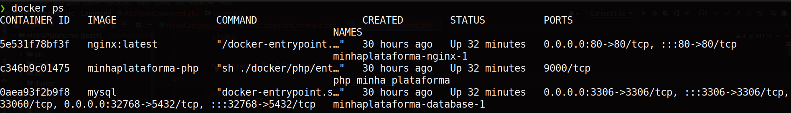

Minha plataforma

É um sistema desenvolvido em symfony 6
0 - Acessando o terminal dentro da pasta do projeto, 
podemos execuar o seguinte comando:

    docker compose build
    docker compose up -d

1 - Identificar o id do container do PHP executando o comando abaixo

    docker ps

 

2 - Verificar o id do container php

3 - Acessar o container do PHP

    Executar o docker exec -it "id_container_php" bash

4 - Criado as tabelas do banco, Executar o seguinte comando
    
     php bin/console doctrine:migrations:migrate

5 - Adicionado as categorias por um comando

    php bin/console app:add-categories

6 -  Adicionando as noticias por um comando

    php bin/console app:add-news

